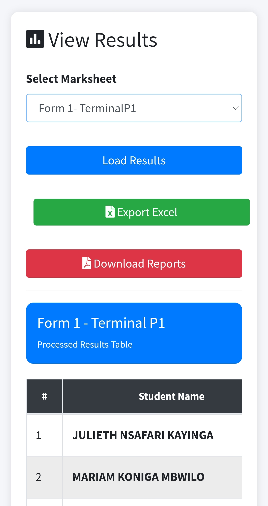
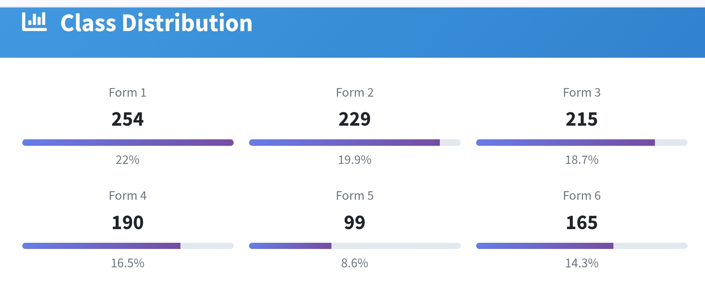
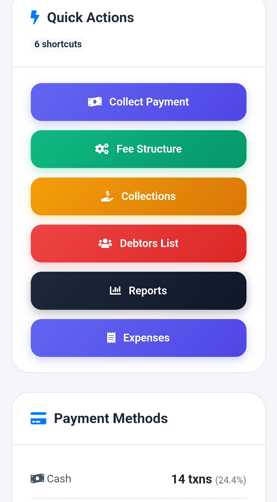

# School Management System

An advanced school management system developed for secondary schools using PHP, MySQL, JavaScript, Bootstrap and mobile-responsive UI.

## Features

- Secure authentication system
- Fingerprint login support
- Student results processing
- Finance management
- Reports generation
- Excel export
- Library management system
- Analytics dashboard
- Mobile responsive design

## Screenshots

### Secure Login

### Results Module

### Class Distribution Analytics

### Finance Dashboard

### Library Management System

## Technologies Used

- PHP
- MySQL
- JavaScript
- Bootstrap
- HTML/CSS

## Developer

Amani Kilesi  
Telecommunications Graduate & Software Developer from Tanzania.

## Vision

Building scalable educational systems for African schools using modern technology.
